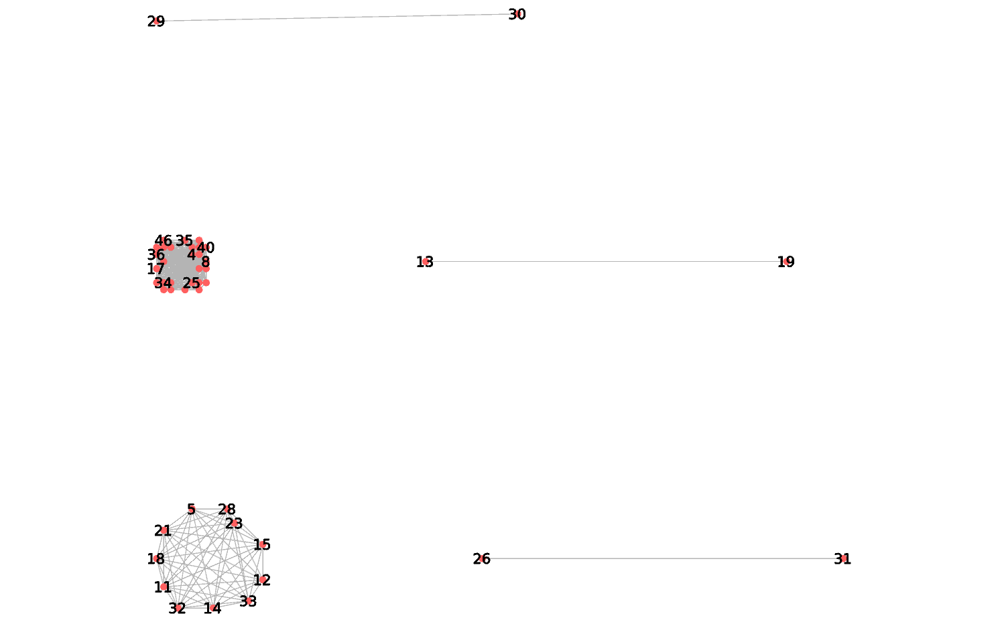

Open foods Facts : Extraction des données
=========================================

Dans ce document, nous nous intéresserons à extraire des données du
fichier csv fourni ici : http://fr.openfoodfacts.org/data.

En effet, après avoir remarqué que le csv contenait un certain nombre de
données manquantes ou des champs compliqués, il semblait important
d'effectuer un pré-traitement avant d'utiliser **tulip**.

Pour améliorer la vitesse d'exécution des traitements, il sera peut être
nécessaire d'enlever certains champs, comme le champ d'ID ou la date de
dernière modification en fonction de ce qui nous intéresse.

Informations sur le fichier de données
--------------------------------------

Il s'agit d'un ensemble d'enregistrements de données alimentaires (plus
de 80.000 produits enregistrés ayant chacun une centaine d'attributs)

.. code:: python

    file_name = '500'
    
    class Data:
        """
        extracts data from csv.
        """
        
        def __init__(self, filename):
            """
            filename: string for the csv file
            """
            self.data_fields = {} # name -> int
            self.data_fields_order = []
            self.data = [] 
    
            with open(filename) as f:
                names = f.readline().split('\t')
                for i,name in enumerate(names):
                    self.data_fields[name] = i
                    self.data_fields_order.append(name)
    
                for a in f.readlines():
                    fields = [b.replace('\n', '') for b in a.split('\t')]
                    self.data.append(fields)
        
        def get_row(self, i):
            """
                :param i: row number in data
                :return: list of field values
            """
            return self.data[i]
        
        def get_nblines(self):
            """ :return: number of lines in the record """
            return len(self.data)
        
        def get_row_dict(self, i):
            res = {}
            for pos, val in enumerate(self.data_fields_order):
                res[val] = self.data[i][pos]
            return res
        
        def get_headers(self):
            return self.data_fields.keys()
        
        def get_fields(self, name):
            res = []
            i = self.data_fields[name]
            for a in self.data:
                res.append(a[i])
            return res
        
        def eliminate_nodes(self, fun_check):
            """ if fun_check returns false, eliminate node from data """
            tmp = []
            for i in range(len(self.data)):
                if fun_check(self.get_row_dict(i)):
                    tmp.append(self.data[i])
            self.data = tmp
        
    
    off = Data(file_name+'.csv')
    
    def check_name(row):
        return row['product_name'] != ''
    
    print(off.get_nblines())
    off.eliminate_nodes(check_name)
    print(off.get_nblines())

.. parsed-literal::

    500
    378

.. code:: python

    print(off.get_headers())

.. parsed-literal::

    ['last_modified_t', 'code', 'stores', 'fructose_100g', 'labels', 'energy_100g', 'additives_tags', 'packaging_tags', 'purchase_places', 'beta-carotene_100g', 'fruits-vegetables-nuts_100g', 'caffeine_100g', 'calcium_100g', 'starch_100g', 'fat_100g', 'erucic-acid_100g', 'ingredients_from_palm_oil_n', 'arachidonic-acid_100g', 'butyric-acid_100g', 'fluoride_100g', 'cocoa_100g', 'caprylic-acid_100g', 'magnesium_100g', 'categories', 'allergens_fr', 'labels_tags', 'countries', 'states_fr', 'selenium_100g', 'nervonic-acid_100g', 'image_url', 'countries_fr', 'mead-acid_100g', 'taurine_100g', 'traces', 'biotin_100g', 'vitamin-a_100g', 'lignoceric-acid_100g', 'chloride_100g', 'phosphorus_100g', 'behenic-acid_100g', 'creator', 'countries_tags', 'vitamin-b2_100g', 'nutrition-score-uk_100g\n', 'cerotic-acid_100g', 'labels_fr', 'stearic-acid_100g', 'ingredients_text', 'arachidic-acid_100g', 'cities_tags', 'traces_fr', 'melissic-acid_100g', 'polyols_100g', 'created_datetime', 'origins_tags', 'first_packaging_code_geo', 'polyunsaturated-fat_100g', 'vitamin-d_100g', 'gondoic-acid_100g', 'maltose_100g', 'silica_100g', 'created_t', 'glucose_100g', 'sodium_100g', 'montanic-acid_100g', 'proteins_100g', 'nutrition_grade_uk', 'bicarbonate_100g', 'cities', 'allergens', 'collagen-meat-protein-ratio_100g', 'zinc_100g', 'origins', 'saturated-fat_100g', 'traces_tags', 'sugars_100g', 'categories_tags', 'serving_size', 'vitamin-b12_100g', 'serum-proteins_100g', 'brands_tags', 'additives', 'carbon-footprint_100g', 'carbohydrates_100g', 'oleic-acid_100g', 'vitamin-b9_100g', 'lauric-acid_100g', 'ingredients_from_palm_oil', 'palmitic-acid_100g', 'emb_codes', 'additives_n', 'packaging', 'salt_100g', 'dihomo-gamma-linolenic-acid_100g', 'vitamin-e_100g', 'ingredients_that_may_be_from_palm_oil_tags', 'image_small_url', 'omega-6-fat_100g', 'myristic-acid_100g', 'iron_100g', 'vitamin-pp_100g', 'chromium_100g', 'sucrose_100g', 'alpha-linolenic-acid_100g', 'main_category', 'molybdenum_100g', 'ph_100g', 'ingredients_from_palm_oil_tags', 'vitamin-b1_100g', 'emb_codes_tags', 'copper_100g', 'vitamin-c_100g', 'ingredients_that_may_be_from_palm_oil', 'states_tags', 'cholesterol_100g', 'chlorophyl_100g', 'monounsaturated-fat_100g', 'omega-3-fat_100g', 'categories_fr', 'docosahexaenoic-acid_100g', 'gamma-linolenic-acid_100g', 'additives_fr', 'vitamin-b6_100g', 'manufacturing_places_tags', 'pnns_groups_2', 'main_category_fr', 'pnns_groups_1', 'omega-9-fat_100g', 'no_nutriments', 'trans-fat_100g', 'last_modified_datetime', 'casein_100g', 'nutrition-score-fr_100g', 'states', 'iodine_100g', 'maltodextrins_100g', 'fiber_100g', 'nucleotides_100g', 'elaidic-acid_100g', 'caproic-acid_100g', 'generic_name', 'manufacturing_places', 'product_name', 'pantothenic-acid_100g', 'nutrition_grade_fr', 'potassium_100g', 'eicosapentaenoic-acid_100g', 'brands', 'ingredients_that_may_be_from_palm_oil_n', 'manganese_100g', 'url', 'vitamin-k_100g', 'energy-from-fat_100g', 'capric-acid_100g', 'alcohol_100g', 'lactose_100g', 'linoleic-acid_100g', 'quantity']

.. code:: python

    print(off.get_row(0))

.. parsed-literal::

    ['0000000024600', 'http://world-fr.openfoodfacts.org/produit/0000000024600/filet-de-boeuf', 'date-limite-app', '1434530704', '2015-06-17T08:45:04Z', '1434535914', '2015-06-17T10:11:54Z', 'Filet de b\xc5\x93uf', '', '2.46 kg', 'plastique', 'plastique', '', '', 'Filet de b\xc5\x93uf', 'fr:filet-de-boeuf', 'Filet-de-boeuf', '', '', '', '', '', '', '', '', '', '', '', '', '', '', 'France', 'en:france', 'France', '', '', '', '', '', '', '', '', '', '', '', '', '', '', '', '', '', '', '', '', 'unknown', 'unknown', 'en:to-be-completed, en:nutrition-facts-to-be-completed, en:ingredients-to-be-completed, en:expiration-date-completed, en:characteristics-to-be-completed, en:categories-completed, en:brands-to-be-completed, en:packaging-completed, en:quantity-completed, en:product-name-completed, en:photos-to-be-validated, en:photos-uploaded', 'en:to-be-completed,en:nutrition-facts-to-be-completed,en:ingredients-to-be-completed,en:expiration-date-completed,en:characteristics-to-be-completed,en:categories-completed,en:brands-to-be-completed,en:packaging-completed,en:quantity-completed,en:product-name-completed,en:photos-to-be-validated,en:photos-uploaded', 'A compl\xc3\xa9ter,Informations nutritionnelles \xc3\xa0 compl\xc3\xa9ter,Ingr\xc3\xa9dients \xc3\xa0 compl\xc3\xa9ter,Date limite compl\xc3\xa9t\xc3\xa9e,Caract\xc3\xa9ristiques \xc3\xa0 compl\xc3\xa9ter,en:Categories-completed,Marques \xc3\xa0 compl\xc3\xa9ter,en:Packaging-completed,en:Quantity-completed,en:Product-name-completed,Photos \xc3\xa0 valider,Photos envoy\xc3\xa9es', 'fr:filet-de-boeuf', 'Filet-de-boeuf', 'http://fr.openfoodfacts.org/images/products/000/000/002/4600/front.3.400.jpg', 'http://fr.openfoodfacts.org/images/products/000/000/002/4600/front.3.200.jpg', '', '', '', '', '', '', '', '', '', '', '', '', '', '', '', '', '', '', '', '', '', '', '', '', '', '', '', '', '', '', '', '', '', '', '', '', '', '', '', '', '', '', '', '', '', '', '', '', '', '', '', '', '', '', '', '', '', '', '', '', '', '', '', '', '', '', '', '', '', '', '', '', '', '', '', '', '', '', '', '', '', '', '', '', '', '', '', '', '', '', '', '', '', '', '', '']

.. code:: python

    d = off.get_row_dict(0)
    for a in d:
        print(a.ljust(50)+': '+d[a])

.. parsed-literal::

    last_modified_t                                   : 1434535914
    code                                              : 0000000024600
    stores                                            : 
    fructose_100g                                     : 
    labels                                            : 
    energy_100g                                       : 
    additives_tags                                    : 
    packaging_tags                                    : plastique
    purchase_places                                   : 
    beta-carotene_100g                                : 
    fruits-vegetables-nuts_100g                       : 
    caffeine_100g                                     : 
    calcium_100g                                      : 
    starch_100g                                       : 
    fat_100g                                          : 
    erucic-acid_100g                                  : 
    ingredients_from_palm_oil_n                       : 
    arachidonic-acid_100g                             : 
    butyric-acid_100g                                 : 
    fluoride_100g                                     : 
    cocoa_100g                                        : 
    caprylic-acid_100g                                : 
    magnesium_100g                                    : 
    categories                                        : Filet de bœuf
    allergens_fr                                      : 
    labels_tags                                       : 
    countries                                         : France
    states_fr                                         : A compléter,Informations nutritionnelles à compléter,Ingrédients à compléter,Date limite complétée,Caractéristiques à compléter,en:Categories-completed,Marques à compléter,en:Packaging-completed,en:Quantity-completed,en:Product-name-completed,Photos à valider,Photos envoyées
    selenium_100g                                     : 
    nervonic-acid_100g                                : 
    image_url                                         : http://fr.openfoodfacts.org/images/products/000/000/002/4600/front.3.400.jpg
    countries_fr                                      : France
    mead-acid_100g                                    : 
    taurine_100g                                      : 
    traces                                            : 
    biotin_100g                                       : 
    vitamin-a_100g                                    : 
    lignoceric-acid_100g                              : 
    chloride_100g                                     : 
    phosphorus_100g                                   : 
    behenic-acid_100g                                 : 
    creator                                           : date-limite-app
    countries_tags                                    : en:france
    vitamin-b2_100g                                   : 
    nutrition-score-uk_100g
                              : 
    cerotic-acid_100g                                 : 
    labels_fr                                         : 
    stearic-acid_100g                                 : 
    ingredients_text                                  : 
    arachidic-acid_100g                               : 
    cities_tags                                       : 
    traces_fr                                         : 
    melissic-acid_100g                                : 
    polyols_100g                                      : 
    created_datetime                                  : 2015-06-17T08:45:04Z
    origins_tags                                      : 
    first_packaging_code_geo                          : 
    polyunsaturated-fat_100g                          : 
    vitamin-d_100g                                    : 
    gondoic-acid_100g                                 : 
    maltose_100g                                      : 
    silica_100g                                       : 
    created_t                                         : 1434530704
    glucose_100g                                      : 
    sodium_100g                                       : 
    montanic-acid_100g                                : 
    proteins_100g                                     : 
    nutrition_grade_uk                                : 
    bicarbonate_100g                                  : 
    cities                                            : 
    allergens                                         : 
    collagen-meat-protein-ratio_100g                  : 
    zinc_100g                                         : 
    origins                                           : 
    saturated-fat_100g                                : 
    traces_tags                                       : 
    sugars_100g                                       : 
    categories_tags                                   : fr:filet-de-boeuf
    serving_size                                      : 
    vitamin-b12_100g                                  : 
    serum-proteins_100g                               : 
    brands_tags                                       : 
    additives                                         : 
    carbon-footprint_100g                             : 
    carbohydrates_100g                                : 
    oleic-acid_100g                                   : 
    vitamin-b9_100g                                   : 
    lauric-acid_100g                                  : 
    ingredients_from_palm_oil                         : 
    palmitic-acid_100g                                : 
    emb_codes                                         : 
    additives_n                                       : 
    packaging                                         : plastique
    salt_100g                                         : 
    dihomo-gamma-linolenic-acid_100g                  : 
    vitamin-e_100g                                    : 
    ingredients_that_may_be_from_palm_oil_tags        : 
    image_small_url                                   : http://fr.openfoodfacts.org/images/products/000/000/002/4600/front.3.200.jpg
    omega-6-fat_100g                                  : 
    myristic-acid_100g                                : 
    iron_100g                                         : 
    vitamin-pp_100g                                   : 
    chromium_100g                                     : 
    sucrose_100g                                      : 
    alpha-linolenic-acid_100g                         : 
    main_category                                     : fr:filet-de-boeuf
    molybdenum_100g                                   : 
    ph_100g                                           : 
    ingredients_from_palm_oil_tags                    : 
    vitamin-b1_100g                                   : 
    emb_codes_tags                                    : 
    copper_100g                                       : 
    vitamin-c_100g                                    : 
    ingredients_that_may_be_from_palm_oil             : 
    states_tags                                       : en:to-be-completed,en:nutrition-facts-to-be-completed,en:ingredients-to-be-completed,en:expiration-date-completed,en:characteristics-to-be-completed,en:categories-completed,en:brands-to-be-completed,en:packaging-completed,en:quantity-completed,en:product-name-completed,en:photos-to-be-validated,en:photos-uploaded
    cholesterol_100g                                  : 
    chlorophyl_100g                                   : 
    monounsaturated-fat_100g                          : 
    omega-3-fat_100g                                  : 
    categories_fr                                     : Filet-de-boeuf
    docosahexaenoic-acid_100g                         : 
    gamma-linolenic-acid_100g                         : 
    additives_fr                                      : 
    vitamin-b6_100g                                   : 
    manufacturing_places_tags                         : 
    pnns_groups_2                                     : unknown
    main_category_fr                                  : Filet-de-boeuf
    pnns_groups_1                                     : unknown
    omega-9-fat_100g                                  : 
    no_nutriments                                     : 
    trans-fat_100g                                    : 
    last_modified_datetime                            : 2015-06-17T10:11:54Z
    casein_100g                                       : 
    nutrition-score-fr_100g                           : 
    states                                            : en:to-be-completed, en:nutrition-facts-to-be-completed, en:ingredients-to-be-completed, en:expiration-date-completed, en:characteristics-to-be-completed, en:categories-completed, en:brands-to-be-completed, en:packaging-completed, en:quantity-completed, en:product-name-completed, en:photos-to-be-validated, en:photos-uploaded
    iodine_100g                                       : 
    maltodextrins_100g                                : 
    fiber_100g                                        : 
    nucleotides_100g                                  : 
    elaidic-acid_100g                                 : 
    caproic-acid_100g                                 : 
    generic_name                                      : 
    manufacturing_places                              : 
    product_name                                      : Filet de bœuf
    pantothenic-acid_100g                             : 
    nutrition_grade_fr                                : 
    potassium_100g                                    : 
    eicosapentaenoic-acid_100g                        : 
    brands                                            : 
    ingredients_that_may_be_from_palm_oil_n           : 
    manganese_100g                                    : 
    url                                               : http://world-fr.openfoodfacts.org/produit/0000000024600/filet-de-boeuf
    vitamin-k_100g                                    : 
    energy-from-fat_100g                              : 
    capric-acid_100g                                  : 
    alcohol_100g                                      : 
    lactose_100g                                      : 
    linoleic-acid_100g                                : 
    quantity                                          : 2.46 kg

.. code:: python

    l = off.get_fields('countries_tags')
    countries = []
    for i in l:
        countries.extend([ j.replace(' ', '') for j in i.split(',') ])
    from collections import Counter
    cptr = Counter(countries)
    for s in cptr:
        print(s)

.. parsed-literal::

    
    en:canada
    en:singapore
    en:australia
    en:united-kingdom
    en:new-zealand
    en:saudi-arabia
    en:switzerland
    en:spain
    en:france
    en:belgium
    en:united-states
    en:germany
    en:moldova
    en:thailand
    en:reunion
    en:brazil
    en:finland
    en:panama

A partir de ces données, il est possible de construire un graphe biparti
qui associe à chaque produit un pays dans lequel il est vendu.

Ce graphe biparti aura deux types de sommets : Le premier type sera un
nom de produit et le second un pays où il est vendu.

.. code:: python

    bipartite = {}
    prop = 'countries_tags'
    
    l = off.get_fields(prop)
    edges = []
    for i,a in enumerate(l):
        edges.extend([ (i, j.replace(' ', '')) for j in a.split(',') ])
    # now edges contains a list of (product, country)
    
    # bipartite: country -> [product id(int)] list 
    for u,v in edges:
        if v in bipartite:
            bipartite[v].append(u)
        else:
            bipartite[v] = [u]
        
    print([len(i) for i in bipartite])

.. parsed-literal::

    [0, 9, 12, 12, 17, 14, 15, 14, 8, 9, 10, 16, 10, 10, 11, 10, 9, 10, 9]

Maintenant que nous avons créé le graphe biparti, nous pouvons calculer
le graphe induit à partir du graphe biparti (méthode de Zachari Neal).

.. code:: python

    induced = {} # set of products with a list of product (adjency list)
    weights = {} # set of couples (product, product) -> weight (float)
    for country in bipartite:
        print(country)
        weight = float(len(bipartite[country]))
        for prod1 in bipartite[country]:
            for prod2 in bipartite[country]:
                if prod1 < prod2:
                    if prod1 not in induced:
                        induced[prod1] = []
                    if prod2 not in induced[prod1]:
                        induced[prod1] = [prod2]
                    weights[(prod1,prod2)] = weights.get((prod1, prod2), 0.)+1./weight
    
    print(max(weights.values()))

.. parsed-literal::

    
    en:canada
    en:singapore
    en:australia
    en:united-kingdom
    en:new-zealand
    en:saudi-arabia
    en:switzerland
    en:spain
    en:france
    en:belgium
    en:united-states
    en:germany
    en:moldova
    en:thailand
    en:reunion
    en:brazil
    en:finland
    en:panama
    0.5

Maintenant que nous avons calculé le graphe induit, nous pouvons générer
un format dont nous nous servirons pour la visualisation.

.. code:: python

    import json
    
    output = {}
    output['nodes'] = [ str(i) for i in induced ]
    output['names'] = [ str(i) for i in induced ]
    output['edges'] = [ {'from':str(i) , 'to':str(j) , 'value': weights[(i,j)]} for (i,j) in weights ]
    print(json.dumps(output, sort_keys=True))

.. parsed-literal::

    {"edges": [{"from": "6", "to": "9", "value": 0.07692307692307693}, {"from": "10", "to": "17", "value": 0.07692307692307693}, {"from": "0", "to": "20", "value": 0.07692307692307693}, {"from": "1", "to": "17", "value": 0.07692307692307693}, {"from": "0", "to": "7", "value": 0.07692307692307693}, {"from": "1", "to": "6", "value": 0.07692307692307693}, {"from": "0", "to": "10", "value": 0.07692307692307693}, {"from": "3", "to": "7", "value": 0.07692307692307693}, {"from": "6", "to": "7", "value": 0.07692307692307693}, {"from": "17", "to": "20", "value": 0.07692307692307693}, {"from": "6", "to": "10", "value": 0.07692307692307693}, {"from": "5", "to": "18", "value": 0.125}, {"from": "0", "to": "17", "value": 0.07692307692307693}, {"from": "0", "to": "4", "value": 0.07692307692307693}, {"from": "4", "to": "10", "value": 0.07692307692307693}, {"from": "2", "to": "6", "value": 0.07692307692307693}, {"from": "15", "to": "18", "value": 0.125}, {"from": "5", "to": "11", "value": 0.125}, {"from": "4", "to": "16", "value": 0.07692307692307693}, {"from": "9", "to": "16", "value": 0.07692307692307693}, {"from": "14", "to": "15", "value": 0.125}, {"from": "5", "to": "21", "value": 0.125}, {"from": "11", "to": "21", "value": 0.125}, {"from": "2", "to": "17", "value": 0.07692307692307693}, {"from": "0", "to": "1", "value": 0.07692307692307693}, {"from": "5", "to": "14", "value": 0.125}, {"from": "14", "to": "18", "value": 0.125}, {"from": "14", "to": "21", "value": 0.125}, {"from": "11", "to": "15", "value": 0.125}, {"from": "7", "to": "8", "value": 0.07692307692307693}, {"from": "6", "to": "16", "value": 0.07692307692307693}, {"from": "8", "to": "9", "value": 0.07692307692307693}, {"from": "3", "to": "17", "value": 0.07692307692307693}, {"from": "15", "to": "23", "value": 0.125}, {"from": "1", "to": "16", "value": 0.07692307692307693}, {"from": "3", "to": "6", "value": 0.07692307692307693}, {"from": "1", "to": "10", "value": 0.07692307692307693}, {"from": "7", "to": "20", "value": 0.07692307692307693}, {"from": "9", "to": "20", "value": 0.07692307692307693}, {"from": "12", "to": "18", "value": 0.125}, {"from": "13", "to": "19", "value": 0.5}, {"from": "18", "to": "21", "value": 0.125}, {"from": "0", "to": "8", "value": 0.07692307692307693}, {"from": "2", "to": "7", "value": 0.07692307692307693}, {"from": "4", "to": "6", "value": 0.07692307692307693}, {"from": "4", "to": "17", "value": 0.07692307692307693}, {"from": "6", "to": "20", "value": 0.07692307692307693}, {"from": "10", "to": "20", "value": 0.07692307692307693}, {"from": "16", "to": "20", "value": 0.07692307692307693}, {"from": "12", "to": "23", "value": 0.125}, {"from": "0", "to": "2", "value": 0.07692307692307693}, {"from": "1", "to": "3", "value": 0.07692307692307693}, {"from": "4", "to": "8", "value": 0.07692307692307693}, {"from": "2", "to": "8", "value": 0.07692307692307693}, {"from": "11", "to": "14", "value": 0.125}, {"from": "6", "to": "17", "value": 0.07692307692307693}, {"from": "5", "to": "23", "value": 0.125}, {"from": "1", "to": "20", "value": 0.07692307692307693}, {"from": "16", "to": "17", "value": 0.07692307692307693}, {"from": "3", "to": "10", "value": 0.07692307692307693}, {"from": "8", "to": "10", "value": 0.07692307692307693}, {"from": "3", "to": "16", "value": 0.07692307692307693}, {"from": "8", "to": "16", "value": 0.07692307692307693}, {"from": "14", "to": "23", "value": 0.125}, {"from": "12", "to": "14", "value": 0.125}, {"from": "21", "to": "23", "value": 0.125}, {"from": "2", "to": "20", "value": 0.07692307692307693}, {"from": "1", "to": "4", "value": 0.07692307692307693}, {"from": "3", "to": "9", "value": 0.07692307692307693}, {"from": "2", "to": "3", "value": 0.07692307692307693}, {"from": "1", "to": "9", "value": 0.07692307692307693}, {"from": "6", "to": "8", "value": 0.07692307692307693}, {"from": "10", "to": "16", "value": 0.07692307692307693}, {"from": "15", "to": "21", "value": 0.125}, {"from": "0", "to": "6", "value": 0.07692307692307693}, {"from": "18", "to": "23", "value": 0.125}, {"from": "1", "to": "7", "value": 0.07692307692307693}, {"from": "0", "to": "9", "value": 0.07692307692307693}, {"from": "3", "to": "4", "value": 0.07692307692307693}, {"from": "2", "to": "4", "value": 0.07692307692307693}, {"from": "4", "to": "7", "value": 0.07692307692307693}, {"from": "11", "to": "23", "value": 0.125}, {"from": "0", "to": "16", "value": 0.07692307692307693}, {"from": "7", "to": "16", "value": 0.07692307692307693}, {"from": "0", "to": "3", "value": 0.07692307692307693}, {"from": "1", "to": "2", "value": 0.07692307692307693}, {"from": "4", "to": "9", "value": 0.07692307692307693}, {"from": "2", "to": "9", "value": 0.07692307692307693}, {"from": "5", "to": "12", "value": 0.125}, {"from": "3", "to": "20", "value": 0.07692307692307693}, {"from": "8", "to": "20", "value": 0.07692307692307693}, {"from": "9", "to": "17", "value": 0.07692307692307693}, {"from": "7", "to": "10", "value": 0.07692307692307693}, {"from": "11", "to": "18", "value": 0.125}, {"from": "12", "to": "21", "value": 0.125}, {"from": "2", "to": "16", "value": 0.07692307692307693}, {"from": "7", "to": "17", "value": 0.07692307692307693}, {"from": "2", "to": "10", "value": 0.07692307692307693}, {"from": "9", "to": "10", "value": 0.07692307692307693}, {"from": "5", "to": "15", "value": 0.125}, {"from": "8", "to": "17", "value": 0.07692307692307693}, {"from": "4", "to": "20", "value": 0.07692307692307693}, {"from": "11", "to": "12", "value": 0.125}, {"from": "7", "to": "9", "value": 0.07692307692307693}, {"from": "12", "to": "15", "value": 0.125}, {"from": "3", "to": "8", "value": 0.07692307692307693}, {"from": "1", "to": "8", "value": 0.07692307692307693}], "names": ["0", "1", "2", "3", "4", "5", "6", "7", "8", "9", "10", "11", "12", "13", "14", "15", "16", "17", "18", "21"], "nodes": ["0", "1", "2", "3", "4", "5", "6", "7", "8", "9", "10", "11", "12", "13", "14", "15", "16", "17", "18", "21"]}

.. code:: python

    filename2 = file_name+'_edges.csv'
    with open(filename2, 'w') as f:
        f.write("in out weight\n")
        for a,b in weights:
            f.write('{} {} {}\n'.format(a,b, weights[(a,b)]))
        

Maintenant que nous avons extrait notre graphe, nous pouvons utiliser
tulip pour la visualisation. Nous utilisons l'algorithme :math:`FM^3`.

   première visualisation

On souhaite maintenant afficher les noms des sommets, pour cela, nous
créons un nouveau fichier csv qui contient les différentes informations
requises pour tulip.

.. code:: python

    fields = ['product_name', 'packaging', 'additives_fr', 'nutrition-score-fr_100g']
    missing_value = '#'
    
    filename3 = file_name+'_nodes.csv'
    with open(filename3, 'w') as f:
        f.write((' '.join(['indice']+fields))+'\n')
        for i in range(off.get_nblines()):
            tmp = off.get_row_dict(i)
            indice = str(i)
            packaging = tmp['packaging'] if tmp['packaging'] != '' else missing_value
            name = tmp['product_name'] if tmp['product_name'] != '' else missing_value
            additives = tmp['additives_fr'] if tmp['additives_fr'] != '' else missing_value
            score = tmp['nutrition-score-fr_100g'] if tmp['nutrition-score-fr_100g'] != '' else missing_value
            f.write('{} {} {} {} {}\n'.format(indice, name.replace(' ', '-'), packaging.replace(' ', ''), additives.replace(' ', ''), score))
    

Nous pouvons maintenant mettre des noms sur les sommets :

   Deuxième visualisation

On constate que certains produits ont leur noms manquants. Ceux-ci sont
généralement incomplets et peuvent être éliminés de la base de données
avant le traitement.

On peut maintenant détailler d'avantage en ajoutant plus de sommets (150
sommets qui génèrent environ 1500 arêtes).

Nous obtenons la vue suivante :

   visu3

Pour rappel, les pays représentés sont :

-  en:canada
-  en:united-kingdom
-  en:switzerland
-  en:spain
-  en:france
-  en:united-states
-  en:germany

On peut deviner de quel pays viennent les produits : En effet, le sirop
d'érable viendrait du Canada, le cluster du haut serait l'Espagne et
ainsi de suite.

On note également que pour la France et l'Angleterre, il existe deux
produits communs : "Creamy-Chicken-Pie" et "Marks & Spencer Curiously
Strong mints".

